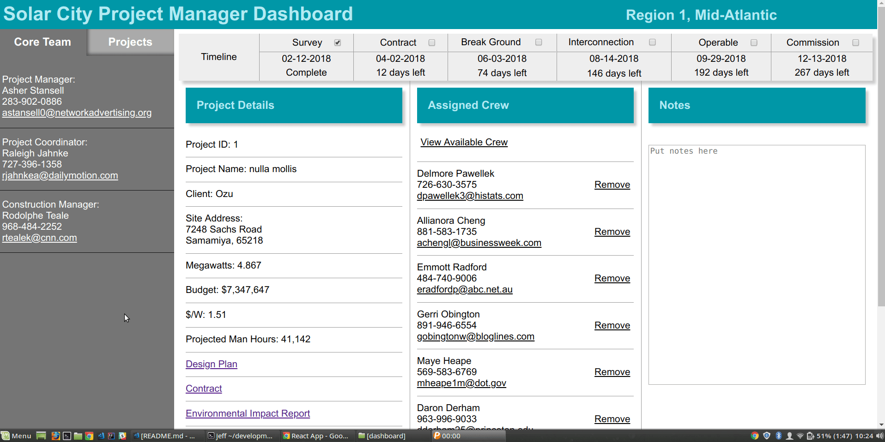

# Solar City Commercial Project Manager Dashboard

## Proposal

### Client Problem Statement

[Solar City](http://www.solarcity.com/) is the world's largest and fastest-growing solar panel installation company, with their commercial construction division showing the largest strides in growth over the past few years. As demand for ever larger solar infrastructure projects grows, project managers are faced with a proportional increase in work load and complexity. At present, Solar City's commercial division has no organized system for project managers to track and update information relevant to the work under their purview. The company began as a residential solar panel installation business, and the new commerical division has out grown the borrowed management tools that were originally designed for residential operations. This lack of appropriate technical infrastructure creates extra work for management teams and introduces an unsustainable level of uncertainty and exposure to error.

### Proposed Solution and Technical Requirements

The distributed nature of the current system is an artifact of the shape of the underlying data and the history of the company's growth. For instance, project data are owned and maintained by specific company departments, while other data like employee data are used by multiple departments across the organization. To tackle the current problem and begin to pay off Solar City's technical debt, it is recommended to create a system that provides centralized endpoints to access and modify data domains, update the current systems and standardize their I/O, all while honoring the autonomy and modularity of these domains. The first phase of the project entails building a Java Spring Boot microservices environment to map the different data domains. Each domain will be appropriately encapsulated and exposed to the environment through a limited, standardized, well-documented RESTful API. These API routes in turn will be managed via an API gateway and a service registry, which together will provide a single point of entry for a frontend client application. Once the backend domains are appropriately defined, a user interface for the client application will be built using React.js. All of these systems will be containerized and deployed to an elastic cloud computing service.

### In Defense of Microservices

Solar City's situation presents a perfect case for the implementation of microservices architecture. While it may seem counter intuitive to propose keeping the databases modular, in the realm of microservices the alternative, a single monolithic database, is considered an anti-pattern. In the quotes below, Netflix Director of Web Engineering Adrian Cockcroft describes the best practice for handling data stores in a microservices environment.

>If you have a bunch of small, specialized services but still have to update them together, they’re not microservices because they’re not loosely coupled. One kind of coupling that people tend to overlook as they transition to a microservices architecture is database coupling, where all services talk to the same database and updating a service means changing the schema. You need to split the database up and denormalize it.
>
>With a single data store it’s too easy for microservices written by different teams to share database structures, perhaps in the name of reducing duplication of work. You end up with the situation where if one team updates a database structure, other services that also use that structure have to be changed too.

## Install and Testdrive

This project depends upon [docker](https://www.docker.com/) and [docker-compose](https://docs.docker.com/compose/). Make sure you have all of these dependencies installed before you proceed.

1. [Clone this repo](https://help.github.com/articles/cloning-a-repository/) to your machine.
2. In a terminal window, from the top-level project directory run `docker-compose up`.
3. Once all of the containers are up and running (wait about 1 minute) navigate to [http://localhost:3000](http://localhost:3000) in your browser and enjoy the app!
4. When you are finished testdriving the app, in the terminal `ctrl + C` to stop the docker images, and then run `docker-compose down` to remove the mounted docker images.

## Features

### The Solar City Commercial Project Manager Dashboard is a one-stop shop for all your project management needs.

it includes:

* A list of all current projects from within the project manager's scope.
* A view of the details of each project, including size, budget, documents, constructions crew member info, and much more.
* An interface for adding and removing crew members from projects.
* A timeline view for tracking project progress, with an interface for marking project milestones as they are completed.



## Bonus Tutorial

### How to add your React UI to your Docker-compose setup

This is just a distillation of different sources I read, applied to the specific microservices pattern we've been learning.

NOTE: in the following steps, wherever you see `dashboard`, replace that with the path of your React project folder, relative to your `docker-compose.yml` file.

1. Add these lines to your `docker-compose.yml` file. The `depends_on` section will be different for you, depending on the names of your microservices.

```
  dashboard:
    image: node:latest
    build: ./dashboard
    ports:
      - 3000:3000
    working_dir: /dashboard
    volumes:
      - ./dashboard:/dashboard
    command: 'npm start'
    depends_on:
      - eureka
      - postgresdev
      - projects-api
      - employees-api 
```

2. In your React project folder, create a new file called `.dockerignore`, and add these lines:

```
node_modules
npm-debug.log
```
3. Thats it! run `docker-compose up` from your top-level project folder, wait for dependencies to download, and then access your frontend at [localhost:3000](http://localhost:3000).